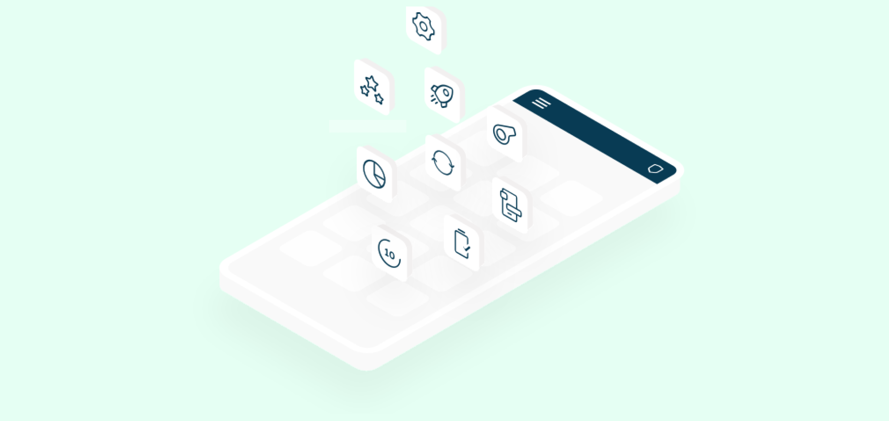
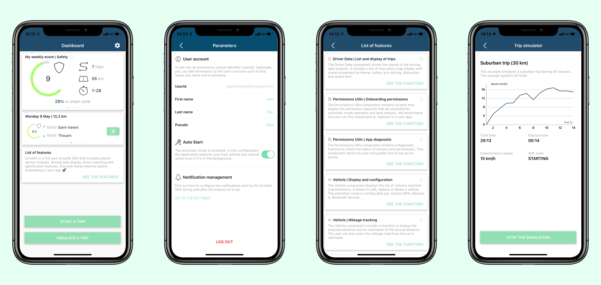

# What is the DriveKit SDK?
The **DriveKit SDK** is a mobile telematics technology developed by [DriveQuant](https://www.drivequant.com/) based on smartphone sensors to analyze vehicle trips and evaluate the influence of driving style on safety, fuel consumption, distraction and speeding. 
The DriveKit SDK also uses the phone's sensors to detect car accidents.

The **DriveKit SDK** is a flexible software suite for creating mobile applications to engage, coach and improve drivers. 
The DriveKit SDK includes open source graphics libraries for trip data display, gamification and driver coaching features.

To integrate the **DriveKit SDK** in your application, follow the installation guidelines: [docs.drivequant.com](https://docs.drivequant.com)

# Why use the Demo application?

The Demo application includes all the **DriveKit SDK** components. It has been developed to guide mobile developers to understand how DriveQuant's telematics solution works.

The components available in the Demo application are:
* **[Trip Analysis](https://docs.drivequant.com/trip-analysis/introduction)** is the heart of the reactor that allows access to the phone's sensors and contains autostart mechanisms to analyse trips while your app runs in background;
* **[Permissions Utils](https://docs.drivequant.com/permissions-utils/introduction)** is used to get user's permissions that allow the SDK to access the smartphone's sensors while running in background;
* **[Driver Data](https://docs.drivequant.com/driver-data/introduction)** manages the driver’s data synchronisation and display. Available screens within this component include:
	 * Trips list and details ;
	 * Ready to use widgets to display information about user's last trips ;
	 * **[My Synthesis](https://docs.drivequant.com/driver-data-my-synthesis-ui/introduction)** screen which compares your average performances per week, month or year with reference levels and also with drivers from your community.
* **[Driver Data Timeline](https://docs.drivequant.com/driver-data-timeline-ui/introduction)** manages display of timelines. These screens contain graphs that represent the chronological evolution of a driver’s weekly or monthly scores;
* **[Vehicle](https://docs.drivequant.com/vehicle/introduction)** is made to select one or more vehicles, to choose the autostart mode for each of them and to manage odometer of each vehicle;
* **[Driver Achievement](https://docs.drivequant.com/driver-achievement/introduction)** contains gaming features (ranking, badges and streaks) that measure driver performance and stimulate driver improvement;
* **[Challenge](https://docs.drivequant.com/challenge/introduction)** is used to display the list of challenges, join a challenge or display challenge details.

Before installing the **DriveKit SDK** in your mobile application, we recommend that you do some tests with the Demo application. It's fast and it will save you time. The Demo application has been specially designed to help you discover smartphone telematics. 

This is why you need to use the application before you start coding:
* Learn how to initialise the DriveKit SDK and create a user.
* Learn how to ask your users for the permissions required to run the application. Smartphone telematics is rigorously regulated because access to sensors in the background is sensitive. 
* Understand the life cycle of a trip analysis. The trip detection, recording and analysis have been optimised and are the result of several years of effort. With the Demo application, smartphone telematics will no longer be a mystery to you.

* To test the open-source graphic components in order to choose the ones you wish to integrate in your application ;
* To validate that the behaviour of the **DriveKit SDK** in your application is perfectly similar to that of the Demo application.

We encourage you to use the code of this application which has been open-sourced especially to save you time. Don't try to be creative because the choices and mechanisms implemented have been carefully designed and comply with the iOS/Android requirements.

# How to use the Demo application?

You can follow the steps below to install, run and experiment with the DriveKit Demo app.

### ✅  Prerequisites
For an integration on iOS you will need the following elements:
* Latest stable version of Xcode
* Git
* CocoaPods
* An iPhone connected to your Mac
* A valid DriveKit API key

### 🧑‍💻 Install and run the Demo app

* The DriveKit SDK can only be used if you have a valid DriveKit API Key. To get a DriveKit API key, contact us at: contact@drivequant.com.
* At the beginning of `DriveKitConfig` class, add your **DriveKit API Key** in the `apiKey` property.
* Build and run the Demo app on your phone.

You can watch the following tutorial video for more details:
[DriveKit Demo App - iOS - Part 1](https://www.loom.com/share/8ef428eda68345278780a4ab90434974)

### ⚙️ Configure the Demo app
1. Ensure that you have set the API Key during the previous step. Otherwise, the interface will display an error message.
2. Set your unique user identifier. We recommend **never** using an email address or phone number to define the unique user ID. It is recommended that you set up a unique, universal and anonymous user ID. For example, you can generate a globally unique identifier.
3. Enter some information such as firstname, last name or pseudo. You can skip this step and set information later.
4. Grant every required permission to allow the application to access the smartphone’s sensors.
5. Add your first vehicle to your account.
That’s it!

You can watch the following tutorial video for more details:
[DriveKit Demo App - iOS - Part 2](https://www.loom.com/share/bc3830607c374531935602221e657509)

### 🚗 Test the Demo app

Congratulations! The application is now configured and ready to run!

You can now discover the main screens of the app:
1. Dashboard: gives access to all the features
2. Parameters: accessible by the ⚙️ icon, it permits to manage user data, auto mode, notifications and disconnection.
3. Feature list: Each card contains a feature of the DriveKit SDK. Explore them all to get a complete view of the SDK.
4. Trip Simulator: feature that allows to reproduce a trip and understand the life cycle of the Trip Analysis component. It should not be embedded in a production application.

The best way to become familiar with smartphone telematics is to try the app in real conditions when travelling by car or public transport.

Alternatively, you can perform some tests in the office using the [trip simulator](https://docs.drivequant.com/trip-analysis/trip-simulator) which allows you to reproduce pre-recorded data from real trips.

You can watch the following tutorial video for more details:
[DriveKit Demo App - iOS - Part 3](https://www.loom.com/share/eb8d8f801d9d485488e0f8e1c74e664e)

We hope you will enjoy discovering the DriveKit SDK. Please feel free to contact us if you have any questions or suggestions. Our goal is to help you save time and leverage the full potential of the DriveKit SDK to boost your product.
Have fun with DriveKit!
